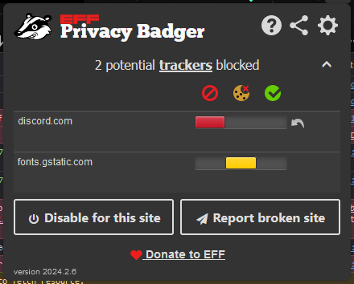

There are a number of cases where third party applications may block legitimate requests made to Discord by our application.

# Privacy Badger
Privacy Badger automatically blocks all requests to Discord, breaking our site. To whitelist our site, simply open the extension on the site and select "Disable for this site".

